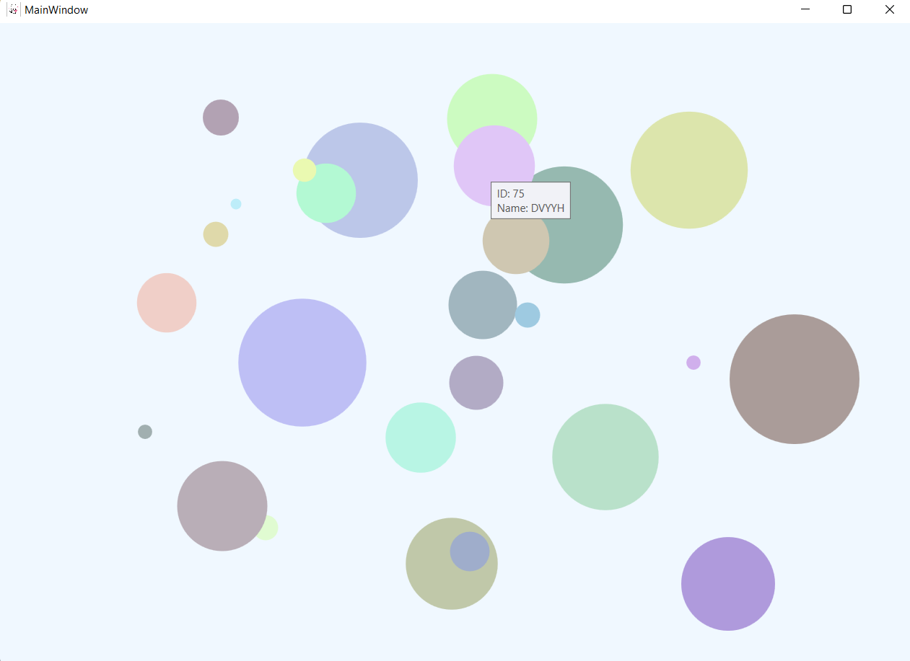

# Приложение для рисования кругов на C#
При нажатии на экран появляются разноцветные круги разных размеров. При наведении на любой круг будет выводиться краткая информация о нем.

## Инструкция по применению
1. Cкачайте проект и распакуйте его.
2. Запустите файл `Prog1.exe` (/Circle-drawing-app/blob/main/Пятна/Prog1.exe)
